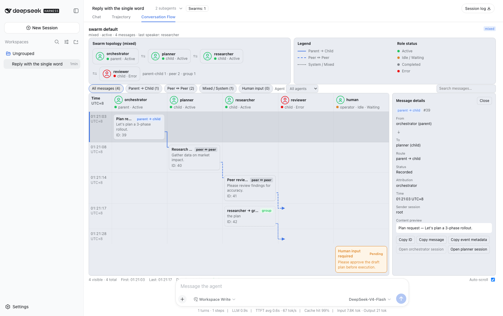
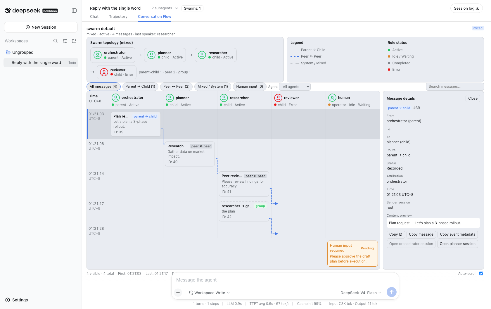
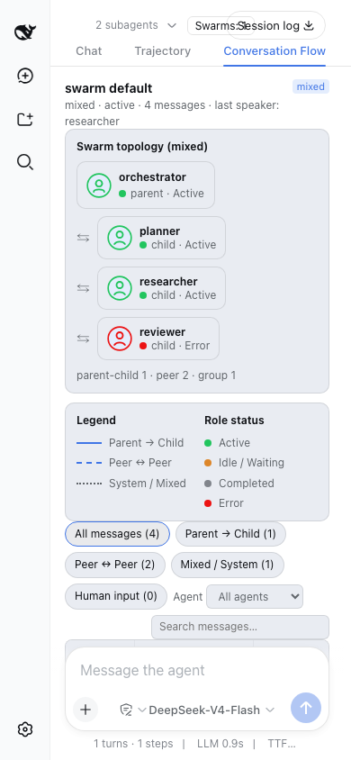
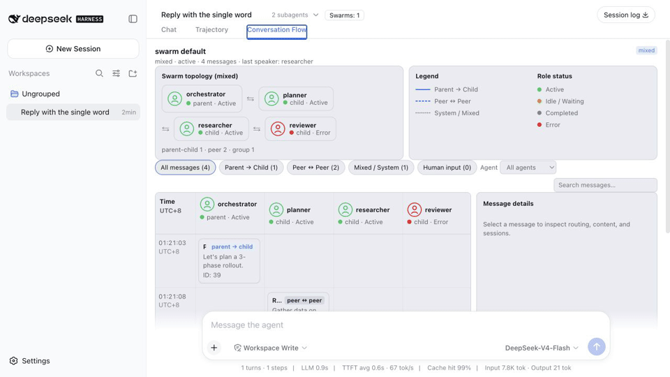

# dsh-swarm-panel

[English](README.md) · [中文](README.zh-CN.md) · [한국어](README.ko.md) · [日本語](README.ja.md) · [Español](README.es.md) · [Português](README.pt-BR.md)

[](https://github.com/stephenlzc/dsh-swarm-panel/actions/workflows/ci.yml)

面向 [DeepSeek Harness](https://github.com/deepseek-ai/deepseek-harness) 的 Conversation Flow 可观测插件：查看 Orchestrator 如何协调子 Agent、检查路由消息、跟踪拓扑变化，并从 Web UI 打开任意子会话。



本仓库是独立的 `dsh-swarm-panel` 插件，不是曾经存在于 Harness 源码仓库中的 `dsh-agent-swarm` 插件。

## 功能

- 持久化 swarm runtime，支持父子、点对点和混合路由。
- 从 session event log 通过 checkpoint 和 cold resume 恢复状态。
- 支持群聊轮次、共享上下文、轻量记忆和人机协作暂停。
- 提供宿主合成的 Conversation Flow 页面：拓扑、泳道、路由筛选、消息详情、Live 跟随和子会话导航。

## UI 图库

图库使用确定性的填充 fixture，展示重要视觉状态，不暴露真实工作区或 API 凭证。

| 桌面总览 | 消息详情 |
| --- | --- |
|  |  |

| 响应式布局 | 拓扑与人机输入 |
| --- | --- |
|  |  |

截图包含待处理 Human input、Error 角色状态、父子和点对点路由、选中消息以及宿主 UI 外壳。

### 交互导览



导览展示桌面总览、选中消息详情和 390×844 响应式布局，来自同一组脱敏 replay 截图，不包含模型输出或凭证。

## 快速开始

插件运行在兼容的 DeepSeek Harness 安装中。先安装 Harness，再将插件安装到 `web` profile。

### npm 发布后

> **用桌面版？** 它的 CLI 默认不在 `PATH` 上，且**保留的 `desktop` profile 不能装第三方插件**（原因见 [CHANGELOG](CHANGELOG.md) 的升级须知）。请用 app 自带的 launcher 装到独立 profile：
>
> ```bash
> # 先下载发布资产：直接把 URL 交给 add 会因 pnpm 的 tarball 完整性校验失败
> # （ERR_PNPM_MISSING_TARBALL_INTEGRITY）。
> curl -sSL -o /tmp/dsh-swarm-panel-1.0.1.tgz \
>   https://github.com/stephenlzc/dsh-swarm-panel/releases/download/v1.0.1/dsh-swarm-panel-1.0.1.tgz
> DSH="/Applications/DeepSeek Harness.app/Contents/Resources/runtime/cli/bin/dsh"
> "$DSH" plugin --profile dswarm add /tmp/dsh-swarm-panel-1.0.1.tgz
> "$DSH" --profile dswarm --dump-config | grep -A2 swarm
> "$DSH" --profile dswarm
> ```
>
> 卸载：`rm -rf ~/.dsh/profiles/dswarm`。

### 从 GitHub Release 安装（当前可用，无需 npm）

每个 Release 都附带打包好的 tarball：

```bash
curl -sSL -o /tmp/dsh-swarm-panel-1.0.1.tgz \
  https://github.com/stephenlzc/dsh-swarm-panel/releases/download/v1.0.1/dsh-swarm-panel-1.0.1.tgz
dsh plugin --profile web add /tmp/dsh-swarm-panel-1.0.1.tgz
dsh web
```

把 Release URL 直接交给 add（`dsh plugin … add https://…tgz`）会因 pnpm 完整性校验失败，请先下载资产，或使用下面的 GitHub spec。

### npm 发布后（当前尚未发布）

```bash
dsh plugin --profile web add dsh-swarm-panel
dsh web
```

### 直接从 GitHub 安装

当前插件位于仓库的 `dsh-swarm-plugin/` 子目录，可使用 pnpm 的 Git 子目录语法：

```bash
dsh plugin --profile web add 'github:stephenlzc/dsh-swarm-panel#path:dsh-swarm-plugin'
dsh web
```

生产环境建议锁定 commit：

```bash
dsh plugin --profile web add \
  'github:stephenlzc/dsh-swarm-panel#path:dsh-swarm-plugin&<commit-sha>'
```

GitHub 安装适合开发快照；稳定版本应在 npm 发布后使用 npm 命令。安装 Git 依赖前请先审阅并信任其源码，因为 Git 依赖可能执行安装阶段代码。

### 从本地 checkout 安装

```bash
git clone https://github.com/stephenlzc/dsh-swarm-panel.git
dsh plugin --profile web add file:./dsh-swarm-panel/dsh-swarm-plugin
dsh web
```

创建或打开 session，让 Orchestrator 创建一个 swarm，然后打开 Chat 和 Trajectory 旁边的 **Conversation Flow** 页签。

## 支持环境

| 组件 | 目标版本 |
| --- | --- |
| DeepSeek Harness | `0.2.0-rc.2` workspace API 及兼容版本 |
| Node.js | `22.19+` 或 Node `24+` |
| Browser | DeepSeek Harness `web` profile |
| Package | `dsh-swarm-panel@1.0.1` |

> **1.0.1 版本** — 兼容 DeepSeek Harness `0.2.0-rc.2`，并修复对抗性审查发现的 16 项稳健性缺陷。完整清单与升级须知见 [CHANGELOG](CHANGELOG.md)。

## 验证状态

- 93 个无密钥插件测试通过（需要 key 的真实 API cold-resume 测试在无 key 时跳过）。
- 宿主合成的真实 Web shell 浏览器 E2E 通过。
- Host 和 client TypeScript 检查通过。
- 已手动验证消息详情、路由和 Agent 筛选、搜索空状态、清除筛选、Live 暂停/恢复、Human input、子会话导航、键盘共存和 390×844 布局。
- `npm pack --dry-run` 包含构建产物、声明、client bundle、patch、README、许可证和截图资源。
- 最终 tarball 已通过 `dsh plugin add` 安装到临时兼容 profiles。

## 已知限制

- Export 尚未实现，因为当前 projection 没有导出数据源。
- 尚未包含 A2A / ACP 外部协议桥接。
- 暂不支持嵌套 sub-swarm，目前只有一层 Orchestrator。
- Memory 使用 Orchestrator 所有的词法检索，尚未自动注入每个 turn prompt。
- Conversation Flow 面板目前只有英文 UI 文案；本仓库 README 提供多语言入口。
- 源码级开发仍需要匹配的 Harness workspace；普通用户应使用发布包或 GitHub 安装。

详见[插件详细 README](dsh-swarm-plugin/README.md)、[中文插件 README](dsh-swarm-plugin/README.zh.md)和[发布清单](docs/release-checklist.md)。

## 许可证

MIT，见 [`dsh-swarm-plugin/LICENSE`](dsh-swarm-plugin/LICENSE)。

## 欢迎提交 Issue 和 Pull Request

发现问题、有新的想法，或想改进这个插件？欢迎提交 [Issue](https://github.com/stephenlzc/dsh-swarm-panel/issues) 或 [Pull Request](https://github.com/stephenlzc/dsh-swarm-panel/pulls)。

也欢迎 Fork。本项目欢迎你基于 `dsh-swarm-panel` 开发自己的扩展、界面改进、集成和工作流实验。
