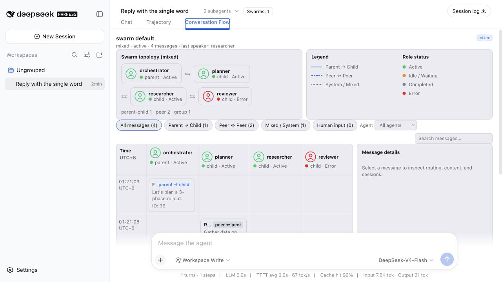
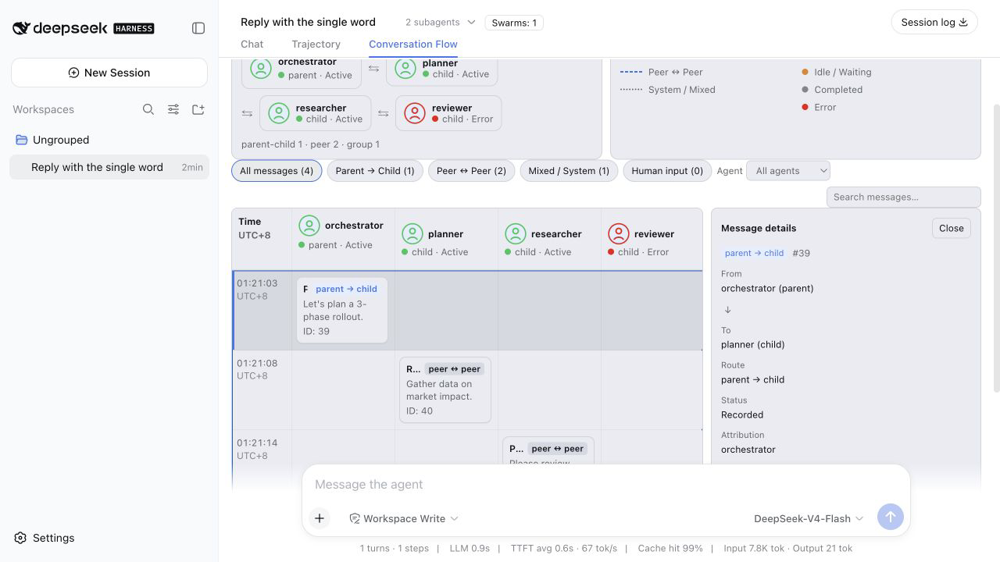
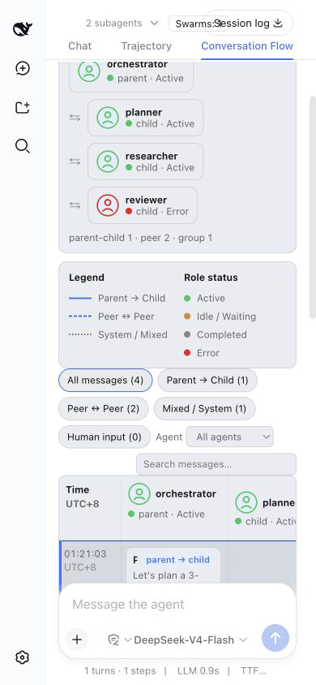

# Conversation Flow UI audit

Captured from the matching DeepSeek Harness web shell with the in-app browser on 2026-08-24. The session uses a deterministic replay fixture with synthetic swarm events; it contains no API key or private workspace data.

## Evidence

## Steps and health

1. Open the seeded session and select **Conversation Flow** — healthy. The host shell exposes the tab, `Swarms: 1`, topology cards, route legend, swimlanes, Human lane, and message list.
2. Select a routed message — healthy. The inspector exposes From/To, Route, Status, Attribution, timestamp, content preview, copy actions, and the child-session action.
3. Filter by `Peer ↔ Peer` — healthy. The list reduced from 4 to 2 messages and exposed a clear-filters action.
4. Search for a missing message and clear the filter — healthy. The empty state explicitly says no matching messages and restores the full flow.
5. Pause and resume Live follow — healthy. The accessible checkbox label changed between `Live follow paused` and `Live follow on` and the footer status followed it.
6. Focus the pending Human input card — healthy as a local UI action. It becomes the active control; no credential or external submission was performed.
7. Open a child session and return with the breadcrumb — navigable. The keyless fixture has no child replay response, so the child session reports the expected “model call issued without a replay fixture” error. This is a fixture limitation, not a live-model verdict.
8. Set the viewport to 390×844 — healthy. The shell collapses to mobile controls, the document reports no body-level horizontal overflow, and the browser console had zero error-level entries. The swimlane itself remains a horizontally scrollable data surface, which is appropriate for preserving route columns.

## Limits

This audit proves host composition and UI interaction against replay data. It does not prove live model quality, real API credentials, npm publication, or every possible browser/assistive-technology combination. Those remain release gates in [`../release-checklist.md`](../release-checklist.md).
